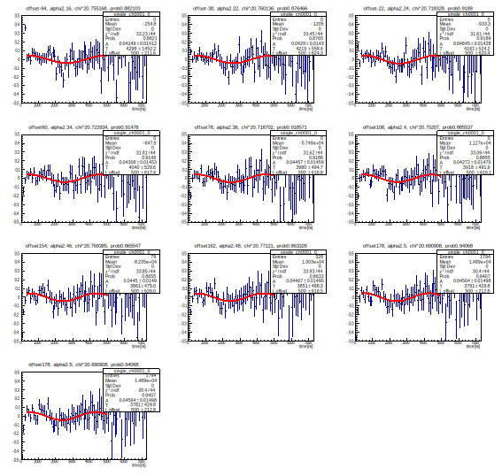

# ksc2022-7

## 08/28からの変更点

### フィッティング関数

08/28の時は，フィッティング関数に縦軸方向のオフセットを入れていた．
```root:fitting1.C
TF1 *f4 = new TF1("f4", "[0]*cos(2*TMath::Pi()*x/[1]) + [2]");
```
けれど，本来アシンメトリーは縦軸方向にオフセットのない三角関数になるべきなので，縦軸方向のオフセットを無くしました．
ついで，時間方向のオフセットを入れました．


```root:fitting2.C
TF1 *f4 = new TF1("f4", "[0]*cos(2*TMath::Pi()*x/[1] + [2])");
```
これをフィッティング関数として採用します．[0]にA, [1]にT, [2]にt_offsetと名前をつけました．

### asymmetry Aの定義

DとUのアシンメトリー $A$ は
$$A = \frac{\alpha N_D(t + t_{\textrm{offset}}) - N_U(t)}{\alpha N_D(t + t_{\textrm{offset}}) + N_U(t)}$$
と定義する．ここでパラメータ $\alpha$ はカウンターDとUの検出効率の補正値，パラメータ $t_{\textrm{offset}}$ はDの時間方向のオフセットである．ここの $t_{\textrm{offset}}$ はフィッティング関数のパラメータ[2]とは別物．

これに応じてフィッティング範囲の制約と初期値は以下のように設定しました．
```root:fitting_params.C
f4->SetParameters(0.1, 3500, 0.0);
f4->SetParLimits(0, 0.01, 0.5);
f4->SetParLimits(1, 2500, 4500);
f4->SetParLimits(2, -500.0, 500.0);
```

まず，$t=0$でDの方がUより大きいと考えられることから，cosが $t=0$ で正に振れるよう，その振幅値は正の範囲にとった．
また[2]が大きくなりすぎないよう，その範囲を $\pm 500 \textrm{ns}$とした．
また，加えた磁束密度2mTから，ラーモア振動の周期は1/(136E6・2E-3)=3700ns程度と推定されることから，[1]の初期値を3500とした．


## 適切なパラメータの探索


パラメータ $\alpha$ と $t_{\textrm{offset}}$ を変えながら $A$ を上記のフィッティング関数f4でフィットし，その $\chi^2$ 誤差やProbabilityがよくなるパラメータの値を探索する．


初めに， $0.1 \leq \alpha \leq 5.1$ ,  $-200 \leq t_{\textrm{offset}} \leq 200$の範囲で探索した．
結果， $\chi^2$ 誤差やProbabilityは以下のようになった．
$\chi^2$ 誤差についてのみ対数をとっている．


なお，probabilityについて極大値を取る点をorder=0.9で探し，probの図中に黒点で示した．
極大値に振った番号に対応する $\alpha$ と $t_{\textrm{offset}}$の値は以下のようである．

#1  t_offset:-122, alpha:2.12  
#2  t_offset:-94, alpha:2.16  
#3  t_offset:-38, alpha:2.22  
#4  t_offset:-22, alpha:2.24  
#5  t_offset:60, alpha:2.34  
#6  t_offset:78, alpha:2.36  
#7  t_offset:108, alpha:2.40  
#8  t_offset:154, alpha:2.46  
#9  t_offset:162, alpha:2.48  
#10  t_offset:178, alpha:2.50  

なお，probで判定した極大点(#1~#10)を $\chi^2 / \textrm{ndf}$ にもプロットしたが，その点の周りで値が小さくなっていることがわかるので抽出した点はフィッティングが良好な点だと判断して良い．

probで判定した極大点(#1~#10)について実際にフィッティングをした結果が以下である．



僕には，#4  t_offset:-22, alpha:2.24の場合が一番良いように見えたので，これを採用しようと思った．(>_<)

この時，ラーモア振動の周期は $T = 4161 \pm 524.2 \textrm{ns}$ であり，推定される磁束密度は $\displaystyle B =\frac{2\pi}{T\gamma} = \frac{1}{4161 \times 10^{-9} \cdot 135 \times 10^6} = 1.77 \pm 0.22 \textrm{mT}$
ただし， $\displaystyle \gamma = \frac{ge}{2m} = 2\pi \cdot 135 \times 10^6$

かけた値 $20 \textrm{Gauss} = 2 \textrm{mT}$ をほとんど $1\sigma$ の範囲にもつ．
